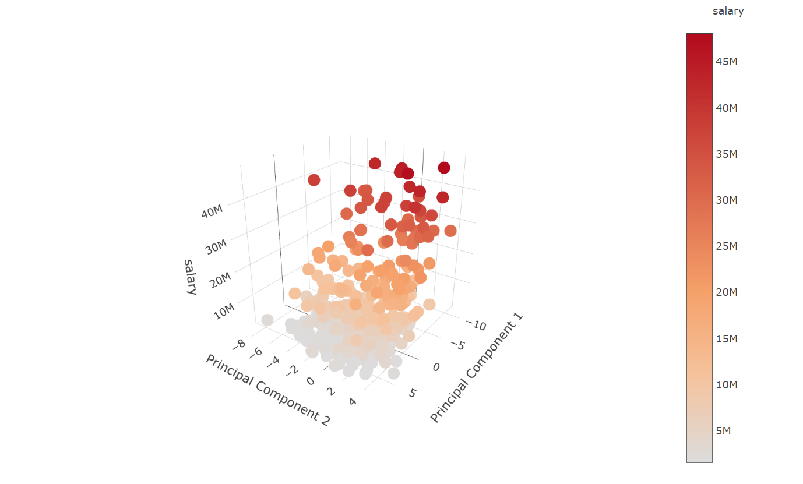

  
\*Webpage version: https://rpubs.com/Jamin/nba_player_salary_202223  
\*All Files: https://github.com/jamingreen/NBAPredictions  

# Executive Summary
As NBA fans for years, we are all curious about the polarised NBA salary. Players who seem to play similar games receive a very different salary. Hence, we want to know the most critical elements in NBA players that make them better than others, while salary is a good standard representing the players’ value in the NBA.  

## Approaches
There are several approaches to the problem, including interviewing NBA players and reading different articles. However, we want to take a more mathematics approach and use secondary source data online and do data analysis ourselves to find our own results. It allows us to give our independent interpretation of the game.  


## Result Summary
This report aims to find the relationships between the players' statistics and the salary in the following year.  

We found player statistics for the 2021-2022 season and their respective salary in the 2022-2023 season. We have collected the player statistics and salaries of 384 NBA players who played in 2021-2022 and will receive a salary in the 2022-23 season. The player statistics are collected from [Basketball Reference](https://www.basketball-reference.com/) and [NBA official website](https://www.nba.com/), and the detailed links are listed below in the Source of files section.  

We started with merging the data from different sources and removing repeated variables.  

In the exploratory data analysis, we start with a univariate analysis of the response variable salary and then explore the correlation of individual variables with salary.  

In the modelling section, we use the RMSE score on the train set to determine the final model. We have 10-fold cross-validation on each model (the 10-fold all use RMSE to hyperparameter tuning). The root mean squared error (RMSE) measures the prediction error, while R-squared measures the proportion of variation explained by the model.  
We have included the following modelling methods:  

* Linear Regression (Train RMSE: 0.4996, R-squared: 0.7285)
* Lasso Regression (Train RMSE: 0.5246, R-squared: 0.7076)
* Elastic Net Regression (Train RMSE: 0.5134, R-squared: 0.7178)
* Stepwise Regression (Train RMSE: 0.5072, R-squared: 0.7535)
* Decision Tree (Train RMSE: 0.5096, R-squared: 0.6438)
* Random Forest (Train RMSE: 0.2264, R-squared: 0.7097)
* Neural Network (Train RMSE: 0.6170, R-squared: 0.6624)

As the Random Forest Model has the lowest RMSE, we chose it as the final model for our prediction. It has 0.4835 for the estimated out-of-bag RMSE. 

In the interpretation part, we will mainly use linear regression and principal component analysis to analyse. We will not use the random forest model as it is hard to give an interpretation from a random forest model.

In the analysis, imperial units are used as it is the standard unit systems in the NBA. The salaries are recorded in USD.    

# Understanding of the problem
We want to use player statistics to find out what kind of players with which kind of attribute will result in higher salary in modern NBA.  
There are 59 explanatory predictive variable after removing repetitive variable in the raw dataset with salary as the responsive variable.

## Source of files:  
player_PGstats_2021.csv -- NBA players statistics per game in 2021-2022 season  
source: https://www.basketball-reference.com/leagues/NBA_2022_per_game.html  
player_Adstats_2021.csv -- NBA players advance statistics in 2021-2022 season
source: https://www.basketball-reference.com/leagues/NBA_2022_advanced.html  
salary2022.csv -- NBA players contract in 2022-2023 season onward  
source: https://www.basketball-reference.com/contracts/players.html  
bio.csv -- NBA player bio (height and weight)  
source: https://www.nba.com/stats/players/bio/?Season=2021-22&SeasonType=Regular%20Season&sort=PLAYER_NAME&dir=1  

## Source Evaluation
We have used Basketball Reference and the official NBA website to collect the data. By comparing the data of the two websites, we can ensure the reliability of the data. The official NBA website without a doubt has high reliability on the statistics of the players such as points, three-point percentage and age. By putting into our program, we conclude the dominating factors.  

Since the 2019-2020 season, Basketball Reference’s data is provided by SportRadar which is the official statists provider of NBA. This partnership minimises the mistakes made and increases the reliability of our sources.  

However, we didn’t apply a wide range of sources to compare data which can improved by including sources such as ESPN and Inpredictable. I would have included a few more seasons to have a more accurate data comparison with a larger sample size. Data such as clutch shooting stats and win probabilities requires a large sample size to produce a valid reference.  


\newpage

# Loading and Exploring Data

## Loading libraries required
Load libraries required for the analysis. 
```{r setup, message=FALSE, warning=FALSE}
library(knitr)
library(plyr)
library(dplyr)
library(tidyr)
library(caret)
library(ggplot2)
library(corrplot)
library(stringr)
library(scales)
library(randomForest)
library(glmnet)
library(rpart)
library(lubridate)
library(plotly)
library(forcats)
library(psych)
library(ggExtra)
library(reshape2)
library(tree)
library(MASS)
library(Metrics)
library(rattle)
library(neuralnet)
library(sigmoid)
opts_chunk$set(echo = TRUE, cache = TRUE)
opts_chunk$set(tidy.opts = list(width.cutoff = 80), tidy = TRUE, fig.height = 6, fig.width = 9)
```

## Loading data files
Read in the data that were downloaded from the sources. 
```{r}
pgstats <- read.csv("files/2022/player_PGstats_2021.csv")
adstats <- read.csv("files/2022/player_Adstats_2021.csv")
salary <- read.csv("files/2022/salary2022.csv")
bio <- read.csv("files/2022/bio.csv")
```

## File description
### player_PGstats_2021.csv
NBA players statistics per game in 2021-2022 season  
source: https://www.basketball-reference.com/leagues/NBA_2022_per_game.html  
The file contains NBA player per-game statistics in 2021-22 season, including points, assists, rebounds, blocks, and steal et al..  
```{r}
dim(pgstats)
str(pgstats)
```

### player_Adstats_2021.csv
player_Adstats_2021.csv -- NBA players advance statistics in 2021-2022 season
source: https://www.basketball-reference.com/leagues/NBA_2022_advanced.html  
This file contains NBA player advance statistics in 2021-22 season, including PER (player efficiency rating), win shares, box score, and VORP (value over replacement player) et al.. 
```{r}
dim(adstats)
str(adstats)
```

### salary2022.csv
salary2022.csv -- NBA players contract in 2022-2023 season onward  
source: https://www.basketball-reference.com/contracts/players.html  
This file contains NBA players' salary, types of contract and the guaranteed amount of money from the contract.  
```{r}
dim(salary)
str(salary)
```

### bio
bio.csv -- NBA player bio (height and weight)  
source: https://www.nba.com/stats/players/bio/?Season=2021-22&SeasonType=Regular%20Season&sort=PLAYER_NAME&dir=1  
This file contains the height and weight of NBA players in season 2021-22.  
```{r}
dim(bio)
str(bio)
```

\newpage

# Preprocessing Data

## Merge data tables

We merge the tables by their primary key (pgstats.player_id) and foreign key (salary.player_id) by inner join (only take the entries which exist in both table). We treat the players that received salary but have not played any game as outliers.

Merge player per-game statistics and advance statistics. 
```{r}
merged <- merge(pgstats, adstats, by = c("player_id", "Tm"))
```
Since there is players that has changed team in the middle of the season, We use the total stats (indicated by Tm = "TOT").  

```{r}
repeated <- names(which(table(merged$player_id) > 1))

for (i in 1:length(repeated))
{
  id <- repeated[i]
  
  use <- merged[which(merged$player_id == id & merged$Tm == "TOT"),]
  temp_tm <- merged$Tm[max(which(merged$player_id == id))]
  merged <- merged[merged$player_id != id,]
  merged <- rbind(merged, use)
  merged$Tm[merged$player_id == id] <- temp_tm
}
```
Remove and rename some variable to increase readability. 
```{r}
merged <- merged %>% 
  dplyr::select(!c(Rk.y, Player.y, Pos.y, Age.y, MP.y, G.y, X,X.1)) %>%
  rename(Rk = Rk.x, Player = Player.x, Position = Pos.x, Age = Age.x, Game_played = G.x, FGpct = FG., X3Ppct = X3P., X2Ppct = X2P., eFGpct = eFG., FTpct = FT., TSpct = TS., ORBpct = ORB., DRBpct = DRB., TRBpct = TRB., ASTpct = AST., STLpct = STL., BLKpct = BLK., TOVpct = TOV., USGpct = USG., WSper48 = WS.48, Game_started = GS, MP = MP.x)
```

<!-- ```{r} -->
<!-- merged <- merged %>% -->
<!--   group_by(player_id) %>% -->
<!--   summarise( -->
<!--     Tm = Tm[length(Tm)], -->
<!--     Rk = Rk.x[1], -->
<!--     Player = Player.x[1], -->
<!--     Position = Pos.x[1], -->
<!--     Age = Age.x[1], -->
<!--     Game_played = sum(G.x), -->
<!--     Game_started = sum(GS), -->
<!--     MP = sum(MP.y) / sum(G.x), -->
<!--     FG = weighted.mean(FG, G.x), -->
<!--     FGA = weighted.mean(FGA, G.x), -->
<!--     FGpct = weighted.mean(FG., G.x), -->
<!--     X3P = weighted.mean(X3P, G.x), -->
<!--     X3PA = weighted.mean(X3PA, G.x), -->
<!--     X3Ppct = weighted.mean(X3P., G.x), -->
<!--     X2P = weighted.mean(X2P, G.x), -->
<!--     X2PA = weighted.mean(X2PA, G.x), -->
<!--     X2Ppct = weighted.mean(X2P., G.x), -->
<!--     eFGpct = weighted.mean(eFG., G.x), -->
<!--     FT = weighted.mean(FT, G.x), -->
<!--     FTA = weighted.mean(FTA, G.x), -->
<!--     FTpct = weighted.mean(FT., G.x), -->
<!--     ORB = weighted.mean(ORB, G.x), -->
<!--     DRB = weighted.mean(DRB, G.x), -->
<!--     TRB = weighted.mean(TRB, G.x), -->
<!--     AST = weighted.mean(AST, G.x), -->
<!--     STL = weighted.mean(STL, G.x), -->
<!--     BLK = weighted.mean(BLK, G.x), -->
<!--     TOV = weighted.mean(TOV, G.x), -->
<!--     PF = weighted.mean(PF, G.x), -->
<!--     PTS = weighted.mean(PTS, G.x), -->
<!--     PER = weighted.mean(PER, MP.x), -->
<!--     TSpct = weighted.mean(TS., G.x), -->
<!--     X3PAr = weighted.mean(X3PAr, G.x), -->
<!--     FTr = weighted.mean(FTr, G.x), -->
<!--     ORBpct = weighted.mean(ORB., G.x), -->
<!--     DRBpct = weighted.mean(DRB., G.x), -->
<!--     TRBpct = weighted.mean(TRB., G.x), -->
<!--     ASTpct = weighted.mean(AST., G.x), -->
<!--     STLpct = weighted.mean(STL., G.x), -->
<!--     BLKpct = weighted.mean(BLK., G.x), -->
<!--     TOVpct = weighted.mean(TOV., G.x), -->
<!--     USGpct = weighted.mean(USG., G.x), -->
<!--     OWS = sum(OWS), -->
<!--     DWS = sum(DWS), -->
<!--     WS = sum(WS), -->
<!--     WSper48 = weighted.mean(WS.48, MP.x), -->
<!--     OBPM = weighted.mean(OBPM, G.x), -->
<!--     DBPM = weighted.mean(DBPM, G.x), -->
<!--     BPM = weighted.mean(BPM, G.x), -->
<!--     VORP = mean(VORP) -->
<!--   ) -->
<!-- ``` -->

The salary dataset contains multiple entries for players who had changed their team in the middle of the season. The salary for each repeated entries are the same.  
```{r, message=FALSE}
salary <- salary %>%
  group_by(Player, player_id, X2022.23) %>%
  summarise(Tm = Tm[1], Signed.Using = Signed.Using[1], Guaranteed = sum(as.numeric(grep(pattern = "[0-9]+",Guaranteed))), Rk = Rk[1])
```
Merge the remain datasets. 
```{r}
merged <- merge(merged, salary, by = c("player_id"))
bio <- bio %>%
  dplyr::select(!Team) %>%
  rename(Player.x = Player)
merged <- merge(merged, bio, by = c("Player.x"), all.x=TRUE)
```

## Save table
```{r, eval=FALSE}
write.csv(merged, "dataset/all2022.csv")
```

```{r, echo=FALSE, message=FALSE, warning=FALSE}
rm(list=ls())
```

### Read in the saved table
```{r}
all <- as.data.frame(read.csv("dataset/all2022.csv"))
```
```{r}
dim(all)
```
There are `r dim(all)[1]` entries.
```{r}
str(all)
```

## Remove repeated variables


### Player Name
```{r}
sum(all$Player.x != all$Player.y)
```
Since there is no difference in the player name, I will remove player.y and renaming player.x to name 
```{r}
all <- all %>%
  dplyr::select(!Player.y) %>%
  rename(name = Player.x)
```

### Rank
It is rank in their original respective table (alphabetical order of player name in player statistics tables and salary in 2022-23 season for salary table).  
Since, it doesn't carry any extra information, I will remove both of the variables.  
```{r}
all <- all %>% dplyr::select(!c(Rk.x, Rk.y))
```

### Team
Tm.x is the team the player in in 2021-22 season while Tm.y is the team of 2022-23 season.  I will change Tm.x to team_2021 and Tm.y to team_2022.
```{r}
all <- all %>% rename(team_2021 = Tm.x, team_2022 = Tm.y)
```

# Exploratory analysis

## The response variable: salary
The aim of this project is to predict the salary next year. I will remove the salary of 2023-24 season onward and change the X2022.23 to numeric variables.  
```{r}
all <- all %>%
  rename(salary = X2022.23) %>%
  mutate(salary = as.numeric(str_extract(salary,"[0-9]+")))
```

```{r}
ggplot(data=all %>% drop_na(salary), aes(x = salary))+
  geom_histogram(bins = 30)+
  labs(title = "Frequency Diagram of NBA salary in 2022-23 season", x = "yearly salary (USD)", y = "frequency")
```
  
The salary is highly right skewed. This is expected as the top NBA players are paid more in order for the team to keep their top players.  
There is high frequency concentrated on 0 to 2 million range. This might be because of the existence of minimum salary in NBA, which is 1 million to 3 million per year depending on their experience [@minSal22]. I will keep that in mind.  

```{r}
summary(all$salary)
```
The salary of salary of NBA players in 2022-23 season (who played in 2021-22 season) ranges from 3.3 million USD to 48.1 million USD. The median of the salary is 5.8 million USD and the mean is 10 million USD.

```{r relvlpos, echo=FALSE}
all$Position <- factor(all$Position, levels = c("PG", "SG", "SF", "PF", "C"))
```


## Important Numeric Variables

I will first use the correlation with salary to get a feel on the numeric variables on the response variables

### Correlation with salary 2022-23

```{r}
numVar <- which(sapply(all, is.numeric))
numVarNames <- names(numVar)
length(numVarNames)
```
There are `r length(numVarNames)` numeric variables

```{r, fig.height= 12, fig.width=12}
all_numVar <- all[,numVar]
all_numVar <- dplyr::select(all_numVar, !X)

cor_Mat <- cor(all_numVar, use = "pairwise.complete.obs")

cor_names <- names(sort(cor_Mat[,"salary"], decreasing = TRUE))[1:20]

cor_Mat <- cor_Mat[cor_names, cor_names]

corrplot.mixed(cor_Mat, tl.pos = "lt")
```

We chose three variables that show high correlation with the salary: Points per game, Value Over replacement player, and assists per game.  
The correlation shows a high multicollinearity among predictive variables.  
For example:  

* FG, FGA, FT, X2PA, FTA, X2P, TOV, and MP all have correlation higher 0.8 with PTS.
* OWS has 0.95 correlation with WS
* BPM has 0.9 correlation with OBPM

### Points
PTS:

    PTS - Points per game

It has the highest correlation with salary among the numeric variables (`r cor_Mat["PTS", "salary"]`). It is the average point per game played.
```{r}
ggplot(all %>% drop_na(PTS, salary), aes(x = PTS, y = salary)) +
  geom_point(col = "blue") +
  geom_smooth(formula = y~x, method = "loess") +
  labs(title = "points per game in NBA 2021-22 vs salary in NBA 2022-23", x = "points per game", y = "yearly salary (USD)")

```
There is a clear linear correlation between salary and points per game. The correlation is smaller when the points per game is below about 9 but increase after it goes above 9 points.

```{r}
ggplot(all %>% drop_na(PTS, salary), aes(x = PTS)) +
    geom_histogram(bins = 30)+
    labs(title = "Frequency Distribution of points per game in NBA 2021-22", x = "points per game", y = "Frequency")

```


### Value Over Replacement player
Value Over Replacement Player:

    VORP - Value Over Replacement Player (available since the 1973-74 season in the NBA); a box score estimate of the points per 100 TEAM possessions that a player contributed above a replacement-level (-2.0) player, translated to an average team and prorated to an 82-game season.
    
Although FG, FGA, FT etc are more highly correlated, they are also highly correlated to points per game (> 0.75). I will look at the next one that is not highly correlated to points per game. It has a correlation of (`r cor_Mat["VORP", "salary"]`) with salary. It is a estimate of the value provide player over a below average player.  

```{r}
ggplot(all %>% drop_na(VORP, salary), aes(x = VORP, y = salary, label = ifelse(VORP <= -0.9 | VORP > 6, name, ""))) +
  geom_point(col = "blue") +
  geom_smooth(formula = y~x, method = "loess") +
  geom_smooth(formula = y~x, method = "glm", linetype = "dotted", col = "red", se= FALSE) +
  labs(title = "Value over replacement player in NBA 2021-22 vs salary in NBA 2022-23", x = "VORP", y = "yearly salary (USD)")+
    geom_text(size = 3, hjust = -0.1)

```
  
It shows clear linear correlation except some in both extreme of the VORP. The non-linear part are due to the outliers while the general trend still shows positive correlation. 

### Assists
Assists:

    AST - Assists per game
    
It has a high correlation with salary while not a having such a high correlation with points per game. It has a correlation of (`r cor_Mat["AST", "salary"]`) with salary. It is the passes that lead to a field goal for the team.
```{r}
ggplot(all %>% drop_na(AST, salary), aes(x = AST, y = salary, label = ifelse(AST > 8, name, "")) ) +
  geom_point(col = "blue") +
  geom_smooth(formula = y~x, method = "loess") +
  geom_smooth(formula = y~x, method = "glm", linetype = "dotted", col = "red", se= FALSE) +
  labs(title = "Assists per game in NBA 2021-22 vs salary in NBA 2022-23", x = "Assists per game", y = "yearly salary (USD)")+
  geom_text(size = 3, hjust = -0.1)
```
  
It show positive correlation until it goes above 6 assists per game where it shows negative correlation. This maybe explained by that the players with high assist are usually not the first attacking choice of the team which means they might not be the top player of the team and thus lower salary.  

# Imputing missing data and factorising character variables.

## Impute missing data
```{r}
Nacol <- names(which(colSums(is.na(all) | all == "") > 0))
sort(colSums(sapply(all[Nacol], function(x) is.na(x) | x == "")), decreasing = TRUE)
```
### Salary
I will impute the salary since it is the most important variable of the dataset (response variable).  
```{r}
kable(all[is.na(all$salary), c("X","name", "salary")])
```
The salary of `r all$name[is.na(all$salary)]` is 125000 USD @IshWainrightSal (source: [spotrac](https://www.spotrac.com/nba/phoenix-suns/ishmail-wainright-74220/), Accessed: 05/08/2022).  
```{r}
all$salary[all$name == "Ish Wainright"] <- 125000
```


### Signed.Using
Signed.Using:

    The type of contract use to sign
    
Changing the value with capitalisation difference to the same to make it the same factor.  
```{r}
unique(all$Signed.Using)

all$Signed.Using[grep("^1st [Rr]ound [Pp]ick",all$Signed.Using)] <- "1st round pick"
all$Signed.Using[grep("Cap [Ss]pace", all$Signed.Using)] <- "Cap space"
```

THe NAs mean nothing special about the signing of the contract. The NAs are replaced by "None".  
```{r}
all$Signed.Using[is.na(all$Signed.Using) | all$Signed.Using == ""] <- "None"
```
```{r}
  ggplot(all, aes(x = fct_reorder(as.factor(Signed.Using), salary, .fun = "mean"), y = salary, fill = Signed.Using)) +
    geom_boxplot()+
    geom_point(stat= "summary", fun = "mean")+
    labs(title = "Type of contract vs salary", x = "Type of contract", y = "yearly salary (USD)") +
    theme(axis.text.x = element_text(angle = 45, hjust = 1))

```
There are no clear ordinal element in the Signed.Using variable so it will be kept as a character variable.  

### Height and Weight
Some of the players height and weight are missing. We manually searched up each player and input them. The data are from [Basketball Reference](https://www.basketball-reference.com/).  
```{r}
kable(all[which(is.na(all$Weight) | is.na(all$Height)), c("name", "Weight", "Height")])
```
I will manually search up their height and weight.  
```{r}
all$Weight[which(is.na(all$Weight))] <- c(190, 235, 290, 220, 226, 185, 225, 265, 290, 230, 218, 284, 260, 237, 175, 236, 250)

all$Height[which(is.na(all$Height))] <- c("7-0", "6-9", "7-3", "6-6", "6-7","6-7", "6-10","6-11", "6-11", "6-7", "6-8", "6-11", "6-10", "6-8", "6-4", "6-8", "6-11")
```
Change height unit from feet to inches. 
```{r}
heightinch <- as.numeric(sapply(all$Height, function(x) substring(x,1,1)))*12 + as.numeric(sapply(all$Height, function(x) substring(x, 3, nchar(x))))

all$Height <- heightinch
```

```{r}
g1 <- ggplot(all, aes(x= as.numeric(Height), y = as.numeric(Weight), col = as.numeric(salary) ,size = salary))+
  geom_point(alpha = 0.7) +
  theme_minimal()+
  labs(title = "Weight, Height and salary")+
  scale_color_continuous(high = "#132B43", low = "#56B1F7")
  
ggMarginal(g1, type = "boxplot")
```
There clear positive correlation between height and weight but there is no visible correlation with salary.  

### X3Ppct
X3Ppct:
    
    3 point field goal percentage
 
Some players had not made any 3 points attempt in the season which become NA.     
```{r}
kable(all[which(is.na(all$X3Ppct)), c("name","X3P", "X3PA","X3Ppct")])
```
I will impute by setting to 0 if there is no 3 point attempt.
```{r}
all$X3Ppct[which(is.na(all$X3Ppct))] <- sapply(which(is.na(all$X3Ppct)), function(x) ifelse(all$X3PA[x] == 0, 0, all$X3P[x] / all$X3PA[x]))
```

```{r}
ggplot(all, aes(x = X3Ppct, y = salary)) +
    geom_point()+
    geom_smooth(col = "red", formula = y~x, method = "glm")+
    labs(title = "3 point percentage vs salary", x = "3 point field goal percentage", y = "yearly salary (USD)")
```
It shows a slight but not significant correlation between salary and 3 point percentage. Most players' three point percentage lies between 20% and 43%.  

```{r}
ggplot(all, aes(x = X3Ppct, y = salary, col = Position))+
    geom_point()+
    geom_smooth(formula = y~x, method = "glm")+
    facet_grid(Position~.)+
    labs(title = "3 point percentage vs salary for each position", x = "3 point field goal percentage", y = "yearly salary (USD)")

```
There are little to none correlation if separate to each position. This might be the result of the modern NBA requires everyone to have certain degree of three point ability regardless of their position.  


### Position
The position of the following is 
```{r}
kable(all[is.na(all$Position), c("name", "Position")])
```
I will impute manually by search up their primary position
```{r}
all$Position[is.na(all$Position)] <- c("SG", "SF", "PF", "SG", "PF", "SG", "PG", "PG")
```

```{r}
ggplot(all, aes(x = Position, y = salary, fill = Position))+ 
  geom_boxplot()+
  labs(title = "salary distribution for each position")
```
Although there are a number corresponding to each position in basketball, the above show no ordinal correlation with the salary. Hence, I will keep it as a factor.  

### FTpct
FTpct:

    Free throw percentage
  
Some players had not made a free throw attempt throughout the season which is record as NA.
```{r}
kable(all[which(is.na(all$FTpct)), c("FT", "FTA", "FTpct")])
```
I will impute by setting to 0 if there is no free throw attempt.
```{r}
all$FTpct[which(is.na(all$FTpct))] <- sapply(which(is.na(all$FTpct)), function(x) ifelse(all$FTA[x] == 0, 0, all$FT[x] / all$FTA[x]))
```

```{r}
ggplot(all, aes(x = FTpct, y =salary))+
    geom_point()+
    geom_smooth(formula = y~x, method = "glm")+
    labs(title = "Free throw percentage vs salary", x = "free throw percentage", y = "yearly salary (USD)")

```

### Guaranteed
Guaranteed:

    The amount of a player's remaining salary that is guarenteed.
    
Since it is a direct indication of the salary, I will remove this variable.
```{r}
all <- dplyr::select(all, !Guaranteed)
```

## Factorizing Character Variables
Find all character variables: 
```{r}
chrVar <- names(which(sapply(all, is.character)))
chrVar
```
### Player Id and playe name
I will keep tempfor now to keep track of each entries but will remove them before fitting the model.  

### Team
```{r}
  ggplot(all, aes(x = fct_reorder(as.factor(team_2021), salary, median,.desc = TRUE), y = salary, fill = reorder(as.factor(team_2021), salary, .fun = "mean", decreasing = TRUE))) +
    geom_boxplot()+
    labs(title = "Salary for each team", x = "team in 2021-22", y = "yearly salary in 2022-23 (USD)")+
    theme(axis.text.x = element_text(angle = 45, hjust = 1))+
    guides(fill = guide_legend(title = "Team"))

ggplot(all, aes(x = fct_reorder(as.factor(team_2022), salary, median,.desc = TRUE), y = salary, fill = reorder(as.factor(team_2022), salary, .fun = "mean", decreasing = TRUE))) +
    geom_boxplot()+
    labs(title = "Salary for each team", x = "team in 2022-23", y = "yearly salary in 2022-23 (USD)")+
    theme(axis.text.x = element_text(angle = 45, hjust = 1))+
    guides(fill = guide_legend(title = "Team"))

```

```{r}
all$team_2021 <- as.factor(all$team_2021)
all$team_2022 <- as.factor(all$team_2022)
```


### Signed.Using
I will also remove this variable as this might be a direct indication to the salary of the player.
```{r}
all <- dplyr::select(all, !Signed.Using)
```

\newpage

# Visualization

## The response variable: salary
Although I have already done some visualization, I will visualize it again.
```{r}
summary(all$salary)
```
```{r}
ggplot(data = all, aes(x = "",y = salary))+
    geom_boxplot()+
    labs(y = "salary")+
    coord_flip()+
    theme_minimal()
```
The salary (in USD) ranges from 0.1 million to 48.1 million with mean of 10.1 million and median of 5.8 million.
```{r}
ggplot(data = all, aes(x = salary))+
    geom_histogram(bins = 50)+
    labs(title = "Frequency distribution of salary", x = "yearly salary (USD)", y = "frequency")+
    theme_minimal()
```
As from above, the data is highly right skewed and has a large spike in about 2 million.


```{r}
g1 <- ggplot(all, aes(x = Age, y = salary))+
  geom_point(alpha = 0.7)+
  theme_minimal()+
  geom_smooth(formula = y~x, method = "glm")+
  labs(title = "Age vs Salary")
ggMarginal(g1, type = "boxplot")
```
There are a clear positive correlation of age and salary. This can be due to various reason including the existence of rookie contract, experience players general earns more and players with longer experience have a higher minimum salary.

## Grouping predictors
Group variables to different categories:  

* Player bios: Basic information of the players
* Attendance: Measures of players' actually played
* shooting: General shoot attributes
* 2 pointers: 2 point shooting attributes
* 3 pointers: 3 point shooting attributes
* Free throw: Free throw shooting attributes
* Rebounding: Rebounding attributes
* Playmaking: Team play attributes
* Defence: defence related attributes
* Advance: Advance statistics that measure overall performance 

```{r}
pbio <- c("Age", "Height", "Weight")

attendence <- c("Game_played", "Game_started", "MP", "USGpct")

shooting <- c("FG", "FGA","FGpct","eFGpct", "PTS","TSpct")

X2_point <- c("X2P","X2PA","X2Ppct")

X3_point <- c("X3P","X3PA", "X3Ppct", "X3PAr")

Free_throw <- c("FT", "FTA", "FTpct", "FTr")

rebounding <- c("ORB", "DRB","TRB", "ORBpct", "DRBpct", "TRBpct")

playmaking <- c("AST", "TOV", "ASTpct", "TOVpct")

defence <- c("STL", "BLK", "PF", "STLpct", "BLKpct")

overall_adstats <- c("PER","OWS", "DWS", "WS", "WSper48", "OBPM", "DBPM", "BPM", "VORP")
```

### Player Bio
```{r}
all_bio <- melt(all, id.vars = "salary", measure.vars = pbio)

ggplot(all_bio, aes(x = value, y = salary)) + 
  geom_point()+
  geom_smooth(formula = y~x, method = glm)+
  facet_wrap(vars(variable), scales = "free")
```
The age show clear correlation while height and weight do not show much. It is reasonable as different position requires different height and weight and different player with different height has their own play style that suits their body. There is no clear correlation of their body and their performance and thus salary.  

### Attendence
```{r}
all_attendence <- melt(all, id.vars = "salary", measure.vars = attendence)

ggplot(all_attendence, aes(x = value, y = salary)) + 
  geom_point()+
  geom_smooth(formula = y~x, method = glm)+
  facet_wrap(vars(variable), scales = "free")
```
All of the attributes show positive correlation. This make sense as player with stronger performance get played more and get paid more. Both attendance and salary are related to player performance. 

### Overall shooting
```{r}
all_ovSh <- melt(all, id.vars = "salary", measure.vars = shooting)

ggplot(all_ovSh, aes(x = value, y = salary)) + 
  geom_point()+
  geom_smooth(formula = y~x, method = glm)+
  facet_wrap(vars(variable), scales = "free")
```

Field goal percentage is directly correlated to FG and FGA and it doesn't have large correlation to salary. Effective field goal percentage is removed as it is similar to true shooting percentage and it has less correlation.
```{r}
cor(all$FG, (all$FGA * all$FGpct))
all <- all %>% dplyr::select(!eFGpct)
```

### 2 Pointers
```{r}
all_X2 <- melt(all,id.vars = "salary", measure.vars = X2_point)

ggplot(all_X2, aes(x = value, y = salary)) + 
  geom_point()+
  geom_smooth(formula = y~x, method = glm)+
  facet_wrap(vars(variable), scales = "free")
```
It is out of expectation that 2 point field goal percentage has a negative correlation with salary. This can be due to players who shoot more tends to decrease in shooting percentage from fatigue while player with few attempt is easier to maintain high shooting percentage. At the same time players who shoot more are usually the top player of the team and thus have higher salary. 

### 3 Pointers
```{r}
all_X3 <- melt(all, id.vars = "salary", measure.vars = X3_point)

ggplot(all_X3, aes(x = value, y = salary)) + 
  geom_point()+
  geom_smooth(formula = y~x, method = glm)+
  facet_wrap(vars(variable), scales = "free")
```
All except 3 point attempt rate shows a positive correlation which make sense, as really high 3 point attempt rate shows that the players have small attempt rate and relies on little ways of scoring which are often a role player and thus paid less.  

### Free throw
```{r}
all_ft <- melt(all, id.vars = "salary", measure.vars = Free_throw)

ggplot(all_ft, aes(x = value, y = salary)) + 
  geom_point()+
  geom_smooth(formula = y~x, method = glm)+
  facet_wrap(vars(variable), scales = "free")

```
All attributes have a positive correlation with salary.  

### Rebounding
```{r}
all_rb <- melt(all, id.vars = "salary", measure.vars = rebounding)

ggplot(all_rb, aes(x = value, y = salary)) + 
  geom_point()+
  geom_smooth(formula = y~x, method = glm)+
  facet_wrap(vars(variable), scales = "free")

```
It is out of expectation that the offensive rebound percentage show a negative correlation. This might be explained by only role player will attempt to grab offensive rebound to conserve main player stamina.  

### Playmaking
```{r}
all_pm <- melt(all, id.vars = "salary", measure.vars = playmaking)

ggplot(all_pm, aes(x = value, y = salary)) + 
  geom_point()+
  geom_smooth(formula = y~x, method = glm)+
  facet_wrap(vars(variable), scales = "free")

```
The plots show a strong correlation of turnover and salary. This is because the top players have more usage of the ball and thus easier to turnover the ball.  

### Defending
```{r}
all_df <- melt(all, id.vars = "salary", measure.vars = defence)

ggplot(all_df, aes(x = value, y = salary)) + 
  geom_point()+
  geom_smooth(formula = y~x, method = glm)+
  facet_wrap(vars(variable), scales = "free")

```

### Overall performance
```{r}
all_ovAd <- melt(all, id.vars = "salary", measure.vars = overall_adstats)

ggplot(all_ovAd, aes(x = value, y = salary)) + 
  geom_point()+
  geom_smooth(formula = y~x, method = glm)+
  facet_wrap(vars(variable), scales = "free")

```

\newpage

# Feature Engineering


To reduce complexity of the model, I will combine and delete some variables. A high complexity model will result in overfitting which will lead to a lower accuracy in predicting unseen data.    
Before this, I will save a copy of original data for possible future operation. 
```{r, eval=FALSE}
write.csv(all[,!names(all) %in% c("X")], "dataset/cleaned_data.csv")
```
```{r, echo=FALSE}
rm(list=ls())
```
```{r, echo=FALSE}
all <- as.data.frame(read.csv("dataset/cleaned_data.csv"))
```
## Character variables

### Player Id and name
I will remove player id and name since it unique for each player and thus cannot use in regression, but I will save the player id and name in another variables to take reference from.  
```{r}
players <- all[,c("player_id", "name")]
all <- dplyr::select(all, !c(player_id, name))
```

### Teams  
It show little correlation and this research is mainly about the players' individual statistics. Hence, it is removed. 
```{r}
cor(as.numeric(fct_reorder(as.factor(all$team_2021), all$salary, median)), all$salary)
cor(as.numeric(fct_reorder(as.factor(all$team_2022), all$salary, median)), all$salary)
```
  
There is no clear correlation between salary and team as each team will have varying salary for their star players and bench players. I will remove this variable.  
```{r}
all <- dplyr::select(all, !c(team_2021, team_2022))
```

## Importance of each variable

```{r}
quick_rf <- randomForest(salary~., data = all, ntree = 100, importance = TRUE)

imp_rf <- randomForest::importance(quick_rf)
imp_df <- data.frame(Variables = row.names(imp_rf), MSE = imp_rf[,1])
imp_df <- imp_df[order(imp_df$MSE, decreasing = TRUE),]

ggplot(imp_df[1:20,], aes(x=reorder(Variables, MSE), y=MSE, fill=MSE)) + geom_bar(stat = 'identity') + labs(x = 'Variables', y= '% increase MSE if variable is randomly permuted') + coord_flip() + theme(legend.position="none")
```

## Net Possession Gained 
There are steal, block and offensive rebounds per game record but their correlation is not very strong. I will combine them into possession gain to make a stronger variable as these action will all result in a possession gain for the team.
```{r}
cor(all$STL, all$salary)
cor(all$BLK, all$salary)
cor(all$ORB, all$salary)
```
  
Removing steal, block and offensive rebounds per game and add possession gain.  
```{r}
all <- all %>%
  mutate(possGain = STL + BLK + ORB) %>%
  dplyr::select(!c(STL, BLK, ORB))
```

## Possession Lost
I will combine turn-overs and personal fouls to become possession. These variables have a low importance in the random forest. These actions will result in an possession lost.  
```{r}
imp_df$MSE[imp_df$Variables %in% c("TOV","PF")]
```
```{r}
all <- all %>%
  mutate(possLost = TOV + PF) %>%
  dplyr::select(!c(TOV, PF))
```


## field goal missed + remove field goal percentage and field goal attempt
I will remove anything about two pointer as it is just portion of field goal that is not three pointers.
```{r}
all <- all %>%
  dplyr::select(!c(X2P, X2PA, X2Ppct))
```

I will remove free throw, field goal and 3 point percentage and attempts. I will replace them by free throw, field goal and 3 three point missed.
```{r}
all <- all %>%
  mutate(FGM = FGA - FG, X3M = X3PA - X3P, FTM = FTA - FT) %>%
  dplyr::select(!c(FGA, FGpct, X3PA, X3Ppct, FTA, FTpct))
```

## Removing Game played and add starter
I will remove game started and replace it will starter. It will be define whether that player has start for more than 50% of their game played. I will also remove game played as it is directly related to minutes played while minutes played has a stronger correlation and importance. I will also change minutes play per game to minutes played in total
```{r}
all <- all %>%
  mutate(starter = ifelse(Game_started/Game_played >= 0.5, 1, 0), MP = MP * Game_played) %>%
  dplyr::select(!c(Game_started, Game_played))
all$starter <- as.factor(all$starter)
```

## Win share
I will remove win share and win share per 48 as it is just sum of defensive and offensive win share.  
```{r}
all <- dplyr::select(all, !c(WS, WSper48))
```

## Total rebound
I will remove total rebound as it is the sum of offensive and defensive rebound while defensive rebound has stronger correlation and importance.  
```{r}
all <-dplyr::select(all, !TRB)
```

## Box score
I will remove Box Plus or minus as it is the sum of offensive and defensive box score.
```{r}
cor(all[,c("OBPM", "DBPM", "BPM", "salary")])[,"salary"]
imp_df[imp_df$Variables %in% c("OBPM", "DBPM", "BPM"),]
cor(all$OBPM + all$DBPM, all$BPM)
```

```{r}
all$BPM <- NULL
```

## Free throw rate and three point rate
I will remove them as their are directly related to field goal and field goal missed.  
```{r}
all$FTr <- NULL
all$X3PAr <- NULL
```

\newpage

# Preparing data for modelling
As I am not sure about the effect of the variables on the model, I will not remove any extra variable but look at the results first

```{r}
rm(list = ls()[!ls() %in% c("all", "players")] )
```

## Preprocessing predictor variables
```{r}
numVar <- names(which(sapply(all, is.numeric)))
salary <- all$salary
player_name <- all$name
numVar <- numVar[!numVar %in% c("salary", "X", "name")]
all_num <- all[, numVar]
all_fac <- all[,!names(all) %in% c(numVar, "salary", "name", "X")]
```
There are `r length(numVar)` numeric predictors and `r length(all_fac)` factor predictor.

### Removing skewness of variables
I will use min max normalization for variable with negative value to turn all data to positive.  
Variables that are highly right skewed (skewness > 0.8) are natural logged to reduce skewness.  
Variables that are highly left skewed (skewness < -0.8) are squared to reduce skewness. 
```{r}
log_names <- c()
minMax <- c()
sq_names <- c()
for (i in 1:ncol(all_num))
{
  if (any(all_num[,i] <= 0))
  {
    process <- preProcess(as.data.frame(all_num[,i]), method = "range")
    all_num[,i] <- predict(process, as.data.frame(all_num[,i]))
    minMax <- c(minMax, i)
  }
  if (skew(all_num[,i]) > 0.8)
  {
    all_num[,i] <- log(all_num[,i] + 1)
    log_names <- c(log_names, i)
  }
  else if(skew(all_num[,i]) < -0.8)
  {
    all_num[,i] <- all_num[,i]^2
    sq_names <- c(sq_names, i)
  }
}
log_names <- names(all_num)[log_names]
minMax_names <- names(all_num)[minMax]
sq_names <- names(all_num)[sq_names]
```
These column have been log + 1 due to its skewness.  
(The + 1 is to prevent logging 0 which result in NA) 
```{r, echo=FALSE}
save(log_names, minMax_names, sq_names, file = "rds/normVar.RData")
```

### Normalizing Data
The remaining data is normalized by feature scaling and mean normalization.  
```{r}
all_num[!names(all_num) %in% log_names] <- as.data.frame(scale(all_num[!names(all_num) %in% log_names]))
```

### One hot encoding for categorical variables
I will convert all the remaining variables to numeric (it is required by many machine learning algorithm).
```{r}
all_fac <- as.data.frame(model.matrix(~.-1, as.data.frame(all_fac)))
```

## Dealing with the skewness of response variable
```{r}
skew(salary)
```
The skewness of salary is too high which will be harder to fit a model
```{r}
qqnorm(salary)
qqline(salary)
```
This is a QQ plot where the x axis are the theoretical quantiles while y axis are the sample quantile. The diagonal line is where sample theoretical quantiles perfectly aligned. The placementment of the point indicate the skewness of the sample. 

Salary is too right skewed and not normally distributed.  
```{r}
salary <- log(salary)
skew(salary)
```

After logging, the points lie more towards the line (less skewed).
```{r}
qqnorm(salary)
qqline(salary)
plot(x = 1:length(salary), y = sort(salary))
abline(h = 14)
```

### Combining data
I treat log(salary) < 14 as outlier and remove them from the data. 
```{r}
all_noNorm <- cbind(X = 1:nrow(all), salary = salary, all[, numVar], all_fac)
alldata <- cbind(X = 1:nrow(all), salary = salary, all_num, all_fac)
row.names(alldata) <- players$name
name <- players$name[alldata$salary > 14]
ind <- which(alldata$salary > 14)
alldata <- alldata[alldata$salary > 14,]
all_noNorm <- all_noNorm[alldata$salary > 14,]
```

## Spliting training and testing set
I will use train-test split and 10 fold cross validation in the training set,  
```{r}
inTrain <- sample(1:2, size = nrow(alldata), prob = c(0.8, 0.2),replace = TRUE)
train <- alldata[inTrain == 1,]
test <- alldata[inTrain == 2,]
train_noNorm <- all_noNorm[inTrain == 1,]
test_noNorm <- all_noNorm[inTrain == 2,]
```
```{r, echo=FALSE, eval=FALSE}
save(train, test, file = "rds/split.RData")
```
```{r, echo=FALSE}
load("rds/split.RData")
```

```{r,eval=FALSE}
write.csv(alldata[,-c(1,2)], "dataset/normalized_data.csv")
```

\newpage

# Modelling
In the modelling I will use the cross validation root mean squared error to determine which model to choose.  

## Linear regression
```{r}
mod_lm <- lm(salary~.- X, data = train)
```
```{r, echo = FALSE,eval=FALSE}
saveRDS(mod_lm, "rds/mod_lm.RDS")
```
```{r, echo = FALSE}
mod_lm <- readRDS("rds/mod_lm.RDS")
```


```{r}
plot(mod_lm, which = 1)
plot(mod_lm, which = 2)
plot(mod_lm, which = 3)
plot(mod_lm, which = 4)
abline(h = 4/nrow(train))
```
The cook's distance measures the residual and leverage of that point. It represent the degree of influence on the regression model.
We will take a look at the player with high cook's distance.  
```{r}
sort(cooks.distance(mod_lm), decreasing = TRUE)[1:3]
players[players$name %in% names(which(cooks.distance(mod_lm) > 4/ nrow(train))),]
```

```{r}
summary(mod_lm)
```
### Glossary of the summary
* Residual
  * The difference between each predict value and actual value
  * It ranges from -1.8222 to 1.2703
* Coefficients
  * Estimate
    * The estimate value of the weight
  * Std. Error
    * The standard error of the weight (Similar to standard deviation)
  * t value
    *  The number of standard error of the estimate weight from 0
  * p value
    * The probability of getting the estimate weight if the actual weight is 0
* Residual standard error
  * The standard deviation of residuals
* R-squared
  * The estimate proportion of the responsive variable the model has accounted for
* F-statistics
  * p value: the probability of getting these weight provided that the null hypothesis is all weight is zero.   

The r squared of the model is `r summary(mod_lm)$r.squared`


```{r, warning = FALSE}
rmse(train$salary, mod_lm$fitted.values)
rmse(test$salary, predict(object = mod_lm, newdata = test))
```
The train root mean squared error is `r rmse(train$salary, mod_lm$fitted.values)` while the testing (out of bag) root mean squared error is `r rmse(test$salary, predict(mod_lm, test))`.  

## Lasso regression
```{r}
train_control <- trainControl(method = "cv", number = 10)
param_grid <- expand.grid(alpha = 1, lambda = seq(0.001,0.1, by = 0.0005))

mod_lasso <- train(salary~.-X, data = train, method = "glmnet", trControl = train_control, tuneGrid = param_grid)
```

```{r, echo = FALSE,eval=FALSE}
saveRDS(mod_lasso, "rds/mod_lasso.RDS")
```
```{r, echo = FALSE}
mod_lasso <- readRDS("rds/mod_lasso.RDS")
```

Final model hyperparameter
```{r}
mod_lasso$bestTune
```
lambda is the regularization penalt. 

The coefficient of the final model:
```{r}
coef(mod_lasso$finalModel, mod_lasso$bestTune$lambda)
mod_lasso$results$Rsquared[mod_lasso$results$lambda == mod_lasso$bestTune$lambda]
```
The r squared of the best tuned model is `r mod_lasso$results$Rsquared[mod_lasso$results$lambda == mod_lasso$bestTune$lambda]`.  

```{r}
rmse(predict(mod_lasso), train$salary)
rmse(predict(mod_lasso, test), test$salary)
```
The train root mean squared error is `r rmse(train$salary, predict(mod_lasso))` while the testing (out of bag) root mean squared error is `r rmse(test$salary, predict(mod_lasso, test))`.  

## Elastic Net Regression

```{r}
mod_elaNet <- train(salary~.-X, data= train, method = "glmnet", tuneLength = 10, trControl = trainControl(method = "cv", number = 10))
```

```{r, echo = FALSE,eval=FALSE}
saveRDS(mod_elaNet, "rds/mod_elaNet.RDS")
```
```{r, echo = FALSE}
mod_elaNet <- readRDS("rds/mod_elaNet.RDS")
```

```{r}
mod_elaNet$results$Rsquared[which.min(mod_elaNet$results$RMSE)]
```
The R squared is `r mod_elaNet$results$Rsquared[which.min(mod_elaNet$results$RMSE)]`
```{r}
rmse(predict(mod_elaNet), train$salary)
rmse(predict(mod_elaNet, test), test$salary)
```
The train root mean squared error is `r rmse(train$salary, predict(mod_elaNet))` while the testing (out of bag) root mean squared error is `r rmse(test$salary, predict(mod_elaNet, test))`.  

## Step AIC
```{r}
mod_stepAIC <- stepAIC(mod_lm, scope = list(upper = ~., lower = ~1),trace = FALSE,direction = "both")
```

```{r, echo = FALSE,eval=FALSE}
saveRDS(mod_stepAIC, "rds/mod_stepAIC.RDS")
```
```{r, echo = FALSE}
mod_stepAIC <- readRDS("rds/mod_stepAIC.RDS")
```

```{r}
RSS <- sum((mod_stepAIC$fitted.values - train$salary)^2)
TSS <- sum((train$salary - mean(train$salary))^2)
RSQ <- 1- RSS/TSS
RSQ
```
The R-squared is `r RSQ` and the AIC value is `r min(mod_stepAIC$anova$AIC)`
```{r}
mod_stepAIC$coefficients
rmse(mod_stepAIC$fitted.values, train$salary)
rmse(predict(mod_stepAIC, test), test$salary)
```
The train root mean squared error is `r rmse(train$salary, predict(mod_stepAIC))` while the testing (out of bag) root mean squared error is `r rmse(test$salary, predict(mod_stepAIC, test))`.  

## Decision Tree
```{r, warning = FALSE}
mod_dt <- train(salary~., data = train_noNorm[,-1], method = "rpart", trControl = trainControl("cv", number = 10), tuneLength = 20)
```

Final model hyperparameter
```{r}
mod_dt$bestTune
```
cp indicate the complexity of the tree.

```{r, echo = FALSE,eval=FALSE}
saveRDS(mod_dt, "rds/mod_dt.RDS")
```
```{r, echo = FALSE}
mod_dt <- readRDS("rds/mod_dt.RDS")
```

```{r}
fancyRpartPlot(mod_dt$finalModel, main = "Decision Tree", type = 1)
mod_dt$results$Rsquared[as.numeric(row.names(mod_dt$bestTune))]
```
The R-squared of the model is `r mod_dt$results$Rsquared[as.numeric(row.names(mod_dt$bestTune))]`

```{r}
rmse(train_noNorm$salary,predict(mod_dt))
pred <- predict(mod_dt, test_noNorm)
rmse(test_noNorm$salary, pred)
```
  
The train root mean squared error is `r rmse(train$salary, predict(mod_dt))` while the testing (out of bag) root mean squared error is `r rmse(test$salary, predict(mod_dt, test))`. 

## Random Forest
```{r,eval=FALSE}
mod_rft <- train(salary~., train[,-c(1)], method = "rf", trControl = trainControl(method = "cv", number = 10))
```


```{r, echo=FALSE,eval=FALSE}
saveRDS(mod_rft, file = "rds/mod_rft.RDS")
```
```{r, echo=FALSE}
mod_rft <- readRDS("rds/mod_rft.RDS")
```

Final model hyperparameter:
```{r}
mod_rft$bestTune
```
mtry is the number of sample in each resampling. 

```{r}
rsq_rft <- mod_rft$results$Rsquared[as.numeric(row.names(mod_rft$bestTune))]
```
The R-squared is `r rsq_rft`.  

```{r}
rmse(predict(mod_rft$finalModel, train), train$salary)
rmse(predict(mod_rft$finalModel, test), test$salary)
```
The train root mean squared error is `r rmse(predict(mod_rft, train), train$salary)` while the testing (out of bag) root mean squared error is `r rmse(predict(mod_rft, test), test$salary)`. 


## Neural Network
For the neural network, I have tested with different number of layers and node and this is the final mode hyperparameter with 100 node in first hidden layer, 75 nodes on second hidden layer and 50 node in third hidden layer. (The experimental record can be found in neural_network_train_record.md)
```{r, eval = FALSE}
tunegrid_neural <- c(100,75,50)
tunegrid_neural <- as.data.frame(t(matrix(tunegrid_neural, nrow = 3)))
colnames(tunegrid_neural) <- c("layer1", "layer2", "layer3")
mod_neur <- train(salary~. -X, data = train, method = "neuralnet", tuneGrid = tunegrid_neural, trControl = trainControl(method = "cv", number = 10, verboseIter = TRUE), linear.output = TRUE)
mod_neur$results$RMSE
```
```{r, echo=FALSE}
mod_neur <- readRDS("rds/mod_neu_best_100_75_50.RDS")
```
```{r}
mod_neur$results$Rsquared
```
The R-squared is `r mod_neur$results$Rsquared`.
```{r}
mod_neur$results$RMSE[as.numeric(row.names(mod_neur$bestTune))]
rmse(test$salary, predict(mod_neur$finalModel, test))
```
The train root mean squared error is `r mod_neur$results$RMSE[as.numeric(row.names(mod_neur$bestTune))]
` while the testing (out of bag) root mean squared error is `r rmse(test$salary, predict(mod_neur$finalModel, test))`. 

\newpage

# Final Model (random forest)
Random forest model will be used since it has the lowest training RMSE.

## Hyperparameters
### Mtry

    mtry - Number of variables randomly sampled as candidates at each split

```{r}
mod_rft$finalModel$mtry
```
The number of sample per split is `r mod_rft$finalModel$mtry`.

### ntree

    ntree - number of decision in the random forest
    
```{r}
mod_rft$finalModel$ntree
```
The number of decision in the random forest is `r mod_rft$finalModel$ntree`.  

## Results
### Root Mean Squared Error
Training error:
```{r}
rmse(predict(mod_rft), train$salary)
```
```{r}
absErr <- mean(abs(exp(predict(mod_rft)) - exp(train$salary)))
absErr
```
The root mean squared error is `r rmse(predict(mod_rft), train$salary)`.  
The average difference in predicted variable and actual value in the training set is `r round(absErr / 1e6, 1)` million USD.

Testing error (out-bag-error):
This is the expected error for unseen data.
```{r}
rmse(predict(mod_rft,test), test$salary)
```
```{r}
absErr <- mean(abs(exp(predict(mod_rft,test)) - exp(test$salary)))
absErr
```
The out-of-bag root mean squared error is `r rmse(predict(mod_rft,test), test$salary)`.  
The average difference in predicted variable and actual value in the training set is `r round(absErr / 1e6, 1)` million USD. This mean for unseen data the expected error for the salary is plus or minus `r round(absErr / 1e6, 1)` million USD.  

### R-squared
```{r, warning=FALSE}
RSQ <- mod_rft$results$Rsquared[as.numeric(row.names(mod_rft$bestTune))]
```
The R-squared of the final model is `r RSQ`, which the model has accounted for `r round(RSQ * 100,1)`% of variation of the salary.  

## Variable importance analysis

```{r}
imp_rf <- mod_rft$finalModel$importance
imp_df <- data.frame(Variables = row.names(imp_rf), MSE = imp_rf[, 1])
imp_df <- imp_df[order(imp_df$MSE, decreasing = TRUE), ]

g1 <- ggplot(imp_df[1:20, ], aes(x = reorder(Variables, MSE), y = MSE, fill = MSE)) + geom_bar(stat = "identity") +
    labs(x = "Variables", y = "% increase MSE if variable is randomly permuted") +
    coord_flip() + 
  theme(legend.position = "none")+
  theme_minimal()
g1
```
The length of the bar the percentage increase in MSE is randomly permuted. The higher the value the more important the variable is. 
From the graph, points per game, field goal and age are the top three most important in the model.  

\newpage

# Interpretation

## Pinciple Component Analysis
I will use principle component analysis to investigate the importance and correlation between predictive variables.
```{r}
all_pca <- alldata
all_pca$X <- NULL
all_pca <- as.matrix(all_pca)
rownames(all_pca) <- row.names(alldata)

pca <- prcomp(all_pca, scale = TRUE)

pca.var <- pca$sdev^2
pca.var.per <- round(pca.var/sum(pca.var), 5)
```

### Component analysis
Percentage of information contained in the each principle component:  
```{r}
ggplot(data.frame(value = pca.var.per,index = 1:length(pca.var.per)), aes(x=index, y = pca.var.per)) + 
  geom_bar(stat = "identity")+
  theme_minimal()+
  labs(title = "Percentage of information in each principle component", x = "Principle component", y = "Percentage of information (%)")
```
The plot shows that first 2 components has already represent more than 50% of the variation in the dataset. The following analysis will focus on the first 2 component.  

```{r}
pca.data <- data.frame(Sample = rownames(pca$x), PC1 = pca$x[,1], PC2 = pca$x[,2], id = 1:nrow(pca$x), salary = all$salary[ind])

ggplot(pca.data, aes(x = PC1, y = PC2))+
  geom_point()+
  xlab(paste("PC1 - ", pca.var.per[1], "%", sep = ""))+
  ylab(paste("PC2 - ", pca.var.per[2], "%", sep = ""))+
  theme_minimal() +
  ggtitle("PCA Graph")

fig <- plot_ly(pca.data, x = ~PC1, y= ~PC2, z = ~salary, marker = list(color = ~salary, colorscale = c('#FFE1A1', '#683531'), showscale = TRUE)) %>%
  add_markers() %>%
  layout(scene = list(xaxis = list(title = "Principle Component 1"),
                      yaxis = list(title = "Principle Component 2"),
                      zaxis = list(title = "salary")),
         annotations = list(
                        x = 1.13,
                        y = 1.05,
                        text = 'salary',
                        xref = 'paper',
                        yref = 'paper',
                        showarrow = FALSE
                        )
         )
fig
```


Both the first and second principle components show negative correlation with salary.  
<br>
I will plot out the principle components that contains more than 5% of information of the original dataset.
```{r}
count = 0
for (i in 1:length(pca.var.per))
{
  if (pca.var.per[i] < 0.05)
  {
    break
  }
  else
  {
    print(
      ggplot(data.frame(score = pca$rotation[,i], var = names(pca$rotation[,i])), aes(x = reorder(var, abs(score)), y = abs(score), fill = ifelse(pca$rotation[,i] > 0, "positive", "negative")))+
      geom_bar(stat = "identity")+
      theme_minimal()+
      theme(axis.text.x = element_text(angle = 45, hjust = 1, size = 7))+
      scale_color_manual(values = list("positive" = "blue", "negative" = "red"))+
      labs(title = paste0("Principle Component ",as.character(i)," (", as.character(pca.var.per[i]*100), "%)"), x = "variable", y = "proportion")+
      guides(fill=guide_legend(title=""))
    )
  }
}
```

### Correlation between variables
```{r, fig.height= 4, fig.width=16}
cor_Mat <- cor(data.frame(alldata[,numVar], pca$x[,1:4]))

cor_high <- names(which(rowSums(abs(cor_Mat[,c("PC1", "PC2","PC3","PC4")]) > 0.5) > 0))
cor_high <- cor_high[!cor_high %in% c("PC1", "PC2","PC3","PC4")]
options(scipen = 100)
round(cor_Mat[cor_high,c("PC1", "PC2","PC3","PC4")],digits = 2)
corrplot(cor_Mat[c("PC1", "PC2","PC3","PC4"), cor_high], tl.pos = "lt", method = "number")
```
  
#### First principle component
It is highly correlated with minutes played, field goal, free throw, defensive rebound, assists, points, offensive box score, value over replacement player, possession lost (turnovers and personal fouls), and field goal missed. This means that the above variables vary together. If one increase, then the remaining ones tend to increase as well. I think these statistics are correlated through minutes played as better player usually have higher minutes and better statistics in these criterias.  
<br>

#### Second principle component
It is highly correlated with offensive rebound percentage, defensive rebound percentage, total rebound percentage, weight, and height. This means these variables tend to vary together. These statistics are all related to rebounding. Weight and height are crucial in grabbing rebound as higher weight can lead to easier box out while higher in height can lead to easier catching of the ball which all leads to better rebounding.  


## Linear Regression
Some variable has been removed due to their multicollinearity with each other and their interpretability.  
We will define absolute value of correlation larger than 0.75 as too highly correlated for linear regression.  

* PTS, FGM, FT, possLost are removed due to their high correlation with FG
* OBPM, OWS are removed due to their high correlation with VORP
* ASTpct is removed due to its high correlation with AST.
* X3M is removed due to its high correlation with X3P. 
* Positions are removed due to them having similar weight in the linear model above
```{r}
alldata_lm <- dplyr::select(alldata, !c(X,PTS, FGM, FT, possLost, OBPM, OWS, ASTpct, X3M, PositionPG, PositionSG, PositionSF, PositionPF, PositionC))

mod_lm_sh <- train(salary~., alldata_lm, tuneLength = 20, trControl = trainControl(method = "cv", number = 10), method = "lm")
```

```{r,echo=FALSE}
mod_lm_sh <- readRDS("rds/mod_lm_sh.RDS")
```

```{r}
summary(mod_lm_sh)$r.squared
rmse(predict(mod_lm_sh), alldata$salary)
```
The Rsquared of this model is `r summary(mod_lm_sh)$r.squared` which is still high enough for interpretation and the residual (`r rmse(predict(mod_lm_sh), train$salary)`) is also similar.

### learning curve
```{r, warning=FALSE, results='hide'}
train_control <- trainControl(method = "cv", number = 10)
mod_lm_lcurve <- learning_curve_dat(dat = alldata_lm, method = "lm", outcome = "salary", tuneLength = 20, trControl = train_control, metric = "RMSE", proportion = (1:10)/10)
```
```{r}
ggplot(mod_lm_lcurve, aes(x = Training_Size, y = RMSE, color = Data))+     geom_smooth(method = loess, span = .8, formula = y~x)  + 
  scale_x_continuous(expand = c(0, 0)) +
  scale_y_continuous(expand = c(0, 0))+
  labs(title = "learning curve of linear regression", x = "Training Size", y = "RMSE")+
  theme_minimal()
```
As the learning curve's resampling error and train error are both converging to the a low RMSE, this show that the model with these variable is neither overfitting or underfitting.  

### Coefficients
```{r}
summary(mod_lm_sh)
```
We will take a look at variable with significant weight (p-value < 0.1).  
<br>

**Age**:  
```{r, echo = FALSE}
summary(mod_lm_sh)$coef["Age",]
```
The age show very significant positive weight in the model. The weight is 0.293.  
The possibility of age result in that weight for null hypothesis being 0 is less than $2\cdot 10^{-14} \%$. The weight is more than 9 standard deviation away from 0.  
The NBA minimum salary increase with the years that the players have played in the league from 953k for 0 experience and 2.721M for 10 or more years in the league.  
In addition, player with higher age are often more experienced, while player who are more experience usually gives more confidence to the team. They have already proof with time their ability to play in NBA, which let the team willing to give them a higher salary.  
<br>

**Starter**:  
(starter1 = 1 means the player starts for more to 50% of the game, starter1 = 0 means the player starts for leess than 50% of the game)  
```{r, echo = FALSE}
summary(mod_lm_sh)$coef["starter1",]
```
The starter factor variable show very significant positive weight in the model. The weight is 0.299.  
The possibility of the weight resulting in this weight is 0.057%, which is about 3.5 standard error away from 0.  
Starter player are most often the best players in the team and played the most in a game. Hence, it is reasonable that the starter player get a higher salary.  
<br>

**Field Goal**:  
```{r, echo = FALSE}
summary(mod_lm_sh)$coef["FG",]
```
The field goal has a weight of 0.642 and shows high significance.  
The p-value is $2.5\cdot 10^{-2}$ and 2.3 standard error from 0.  
Players with more field goal means that they have more fire power and stronger ability to score. As the NBA encourages offense, player with strong offensive ability are usually paid more. A high means a higher field goal attempt rate (correlation of FG, FGA = `r cor(alldata$FG, alldata$FG + alldata$FGM)`), which represent the players' offensive importance in the team. Hence, these players with high field goal will usually paid more.  
<br>

**3 Point Field Goal**:  
```{r, echo = FALSE}
summary(mod_lm_sh)$coef["X3P",]
```
The three point field goal has a weight of 0.118 and shows high significance.  
The p-value is 3.7% and 2.1 standard error away from 0.  
In the modern NBA, spacing has become more and more important and valued by every team in the league. It can lead to more wide open chance, more defense loophole from the opponent team and thus easier points. Three point ability of a team is one of the crucial factor that determine the teams offensive spacing. Hence, players with strong 3 point ability are often valuable to the team. A high 3 point field goal indicate that the player has a high 3 point ability which will lead to a higher salary.  
<br>

**Value Over Replacement Player**:  
    
    Value over Replacement Player (VORP) converts the BPM rate into an estimate of each player's overall contribution to the team, measured vs. what a theoretical "replacement player" would provide, where the "replacement player" is defined as a player on minimum salary or not a normal member of a team's rotation. 
(source: https://www.basketball-reference.com/about/bpm2.html)

```{r, echo = FALSE}
summary(mod_lm_sh)$coef["VORP",]
```
The value over replacement player has weight of 1.5 and show high significance.  
The p-value is 3.4% and 2.1 standard error away from 0.  
The value over replacement player (VORP) is a overall estimate of the players' contribution to a team comparing with a rotational player. The higher the VORP, the better the performance of the player and thus usually have a higher salary.  
<br>

**Height**:  
```{r, echo = FALSE}
summary(mod_lm_sh)$coef["Height",]
```
The weight is 0.13 and show high significance.  
The p-value is 1.3% and 2.5 standard error away from 0.  
Height has always been a important player attribute throughout the history of basketball. Pace and acceleration has played a more important role in modern NBA, which indirectly reduce the importance of height as height are usually negatively correlated to quickness. However, it is undeniable that height will affect the players finishing ability, defense ability. Shorter players usually have less defensive capability. This decrease the players'overall value and thus given lower salary.  
<br>

**Minutes Played**:  
```{r, echo = FALSE}
summary(mod_lm_sh)$coef["MP",]
```
The minutes played has weight of -0.143 and shows moderate significance.  
The p-value is 6.9% and -1.8 standard away from 0.  
This result contradict with the correlation of minutes played and salary of `r cor(alldata$MP, alldata$salary)`.  
```{r, echo=FALSE}
all <- read.csv("dataset/cleaned_data.csv")
ggplot(all, aes(x = MP*Game_played, y = salary, label = ifelse(salary > 2e7 & MP*Game_played < 1100, name, "")))+
    geom_point() + 
    geom_text(size = 3, hjust = -0.1)+
    labs(title = "Total minutes played vs salary", x = "total minutes played")
```
This show the players with high salary but low minutes played might be the reason of the result. These players are often injured. This show that more minutes played doesn't necessarily correlated to higher salary. The player salary can also be affected by pass performance and team contribution outside of the court.  
<br>

**Defensive Rebound**:  
```{r, echo = FALSE}
summary(mod_lm_sh)$coef["DRB",]
```
It has weight of 2.5 and show moderate significance.  
It has p-value of 5.4% and 1.9 standard error away from 0.  
Securing defensive rebound is important in a game after the opponent missing their field goal attempts. A high defensive rebound represent less second chance point for the opponent and a chance for transition offense. A high defensive rebound can also indirectly indicate the defensive ability of the team, as a defensive rebound is a result of a successful defense. This factor will lead to a higher salary of the player.  
<br>

**Block Percentage**:  
    
    BLK% - Block Percentage (available since the 1973-74 season in the NBA); the formula is 100 * (BLK * (Tm MP / 5)) / (MP * (Opp FGA - Opp 3PA)). Block percentage is an estimate of the percentage of opponent two-point field goal attempts blocked by the player while he was on the floor.

```{r, echo = FALSE}
summary(mod_lm_sh)$coef["BLKpct",]
```
It has weight of 2.2 and show moderate significance.  
It has p-value of 5% and 2 standard error away from 0.  
A high block percentage represent a strong defensive ability which increase the value of the player, which results in higher salary.  

**Free Throw Missed**:  
```{r, echo = FALSE}
summary(mod_lm_sh)$coef["FTM",]
```
It has a weight of 0.79 and shows moderate significant.  
It has p-value of 9.7% and 1.6 standard error away from 0.
This is counter intuitive as a better free throw player should be better.  
```{r, echo = FALSE, warning=FALSE}
ggplot(all, aes(x = FTA - FT, y = FT/FTA, label = name))+
    geom_point()+
    geom_smooth(method = "glm", formula = y~x)+
    labs(title = "Free throw missed vs Free throw percentage", x = "Free throw missed per game", y = "Free throw percentage")

```
Although it is counter intuitive, the correlation between free throw missed and salary is `r cor(all$salary, all$FTA-all$FT)`. This might be explained by some players like Giannis Antetokounmpo and LeBron James has strong ability but low in free throw percentage.  

\newpage

# Summary of Findings
There are many factors affecting the NBA players’ salaries, and this study provides insight into how the players’ court statistics will affect the players’ salaries and give  reference on how to evaluate a players worth on the court.

The essential attributes are age, whether they are a starter in the team and points-related attributes (including points, field goals, and free throws). When evaluating an NBA player, we should focus on the field goals per game, 3-point field goals per game, their value over replacement players, height, minutes played, and defensive rebound, according to the study.  

## Unexplained variance of salary
The variance not explained by this model could be explained from other perspectives.  

### Getting Expert Opinion
There are different ways of predicting an NBA player’s salary back in the old days, without any help from machine learning. The most common way is interviewing experts that are employed by different NBA teams.  

There are different aspects that an NBA team would consider when they offer a contract to a player. The first and most common one is using the Predicted Market Value(PMV) of a player . By using this method, it considers the value of a player as the percentage of salary cap space he encompasses. The PMV of the player is calculated using different aspects such as age, performance in the previous season, whether it suits the team etc. The PMV is often used as a reference to the general manager of the team.  

Apart from that, interviewing experts that are specialised in sports science is also a way to predict the salary of an NBA player. Those experts could predict the market value of a player by observing the ability of the player, suitability of the player to the team, the age of the player, et, al. And they would compare the salary of the specific player to a player that has a similar market value in order to give a more comprehensive judgement. Therefore, the opinions of the experts are often taken into consideration by the teams.  

Lastly, there is another aspect that many teams would consider, which is the reputation of the player. If the player is an All-star player, in general, they would have higher pay. It is because All-star players have a stronger fan base. Their fans would purchase their jerseys and sneakers, which would bring a fortune to the team. Moreover, it would bring more fans to support their team. Therefore, it is another factor that would lead to a higher salary for a player.  
  
  
## Economical Approach
We can consider the economic factors that may affect the salary of NBA players. The main concern of different teams’ owners would be profit.
As a result, the business value of every player may also be concerned as a factor for team owners to raise or lower the salary of team players.  

The business value of team players could take many different data into account, such as the player’s followers on social media, which may lead to a further promotion to the team. It could also be the sales of NBA jerseys or other related souvenirs, which produces profit directly for the team. If keeping the player would give the team owner a larger return, a higher salary would be given.  

However, this approach would be affected by the location of the teams’ home stadiums. Larger and richer cities would bring the players a much higher business value. Furthermore, there are salary restrictions for players in NBA, so the estimated value would not be accurate and close to reality.  
  
# Reference
  
  
  
  
  

